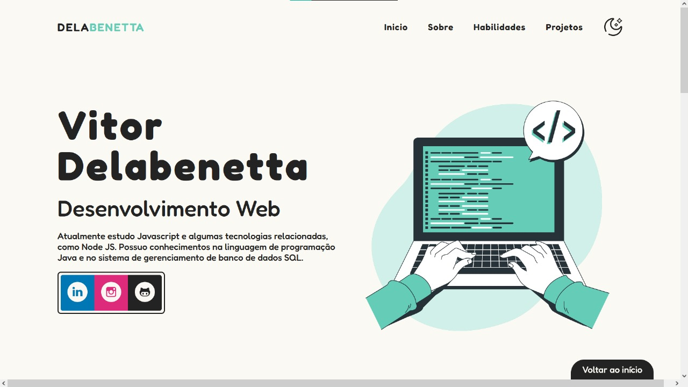
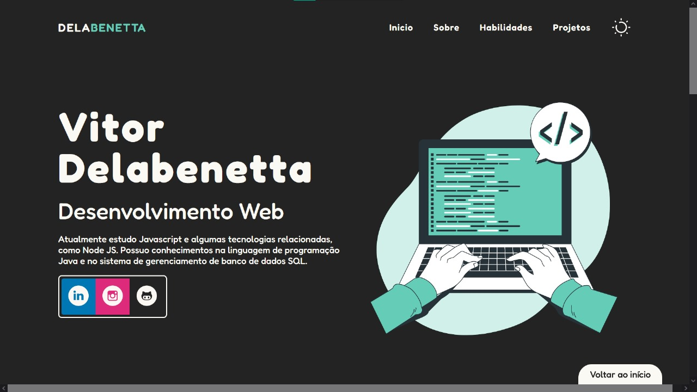

<table align="left">
  <tr>
    <td>
      <b><a href="README.md"> 🇧🇷 Português </a></b>
    </td>
    <td>
      <a href="README-US.md"> 🇺🇸 English </a>
    </td>
  </tr>
</table>

  

# Portfolio
 <!-- HTML -->
 <!-- CSS -->
  <!-- Javascript -->
 <!-- VSCode -->
 <!-- README -->

 

## 💻 Project

Personal portfolio project to present the knowledge in Front-End technologies for Web development.

 

This simple project was produced entirely by me, following simple design concepts and with a simple but targeted programming in order to present the skills and competencies acquired and improved throughout my study time. Inside the portfolio page, there's a button to download my updated personal resume.

 

## Preview

<i>Preview of the portfolio, with the light theme.</i>

<i>Initial portion of the portfolio, with the dark theme.</i>

 

## 🛠 Technologies

This project was developed with the following tools and technologies:

- HTML;
- CSS;
- Javascript;
- Virtual Studio Code;
- Git.
