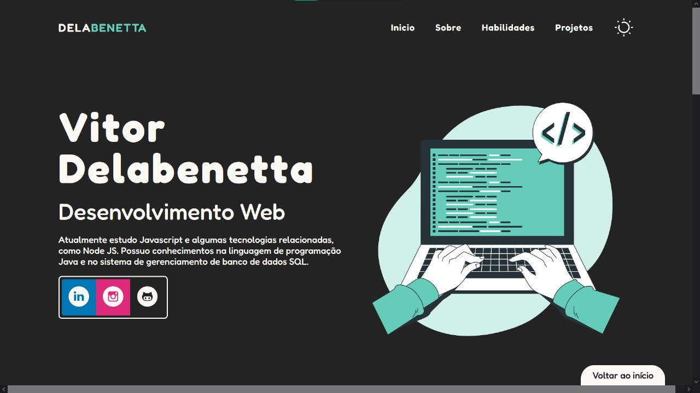

<table align="left">
  <tr>
    <td>
      <b><a href="README.md"> 🇧🇷 Português </a></b>
    </td>
    <td>
      <a href="README-US.md"> 🇺🇸 English </a>
    </td>
  </tr>
</table>

<br><br>

# Portfólio
 <!-- HTML -->
 <!-- CSS -->
 <!-- Javascript -->
 <!-- VSCode -->
 <!-- README -->

<br>

## 💻 Projeto

Projeto de portfólio pessoal para apresentar os conhecimentos em tecnologias de Front-End para desenvolvimento Web.

<br>

Este projeto simples fora produzido inteiramente por mim, seguindo conceitos simples de design e com uma programação simples mas direcionada para apresentar as habilidades e competências adquiridas e aprimoradas ao longo do tempo de estudo. Dentro da página, há um botão para download do meu currículo pessoal atualizado.

<br>

### 👓 Veja você mesmo
Para ter o projeto na sua máquina local, siga este tutorial:
<br>

1. Vá até a página inicial do repositório do projeto.

2. Selecione a opção "<> Code".

3. Copie o link HTTPS do projeto.

4. Escolha um local de preferência na sua máquina e execute o Git lá dentro.

5. Clone o repositório utilizando o comando "git clone [link]":

```bash
git clone https://github.com/VitorDelabenetta/Portfolio.git
```
6. Abra o projeto em seu ambiente de desenvolvimento para trabalhar no código ou simplesmente execute o arquivo "index.html" usando o navegador.

<br>

## Preview


<i>Imagem de preview, com o tema claro ativado.</i>



<i>Porção inicial do portfólio, com o tema escuro ativado.</i>

<br>

## 🛠 Tecnologias

Esse projeto foi desenvolvido com as seguintes ferramentas e tecnologias:

- HTML;
- CSS (responsivo);
- Javascript;
- Virtual Studio Code;
- Git.